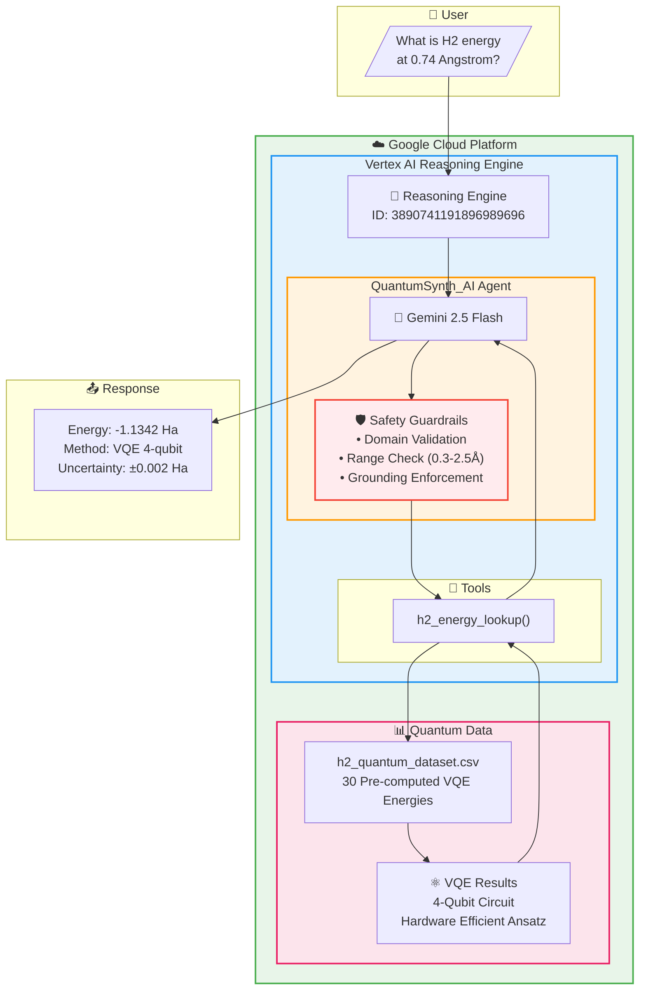
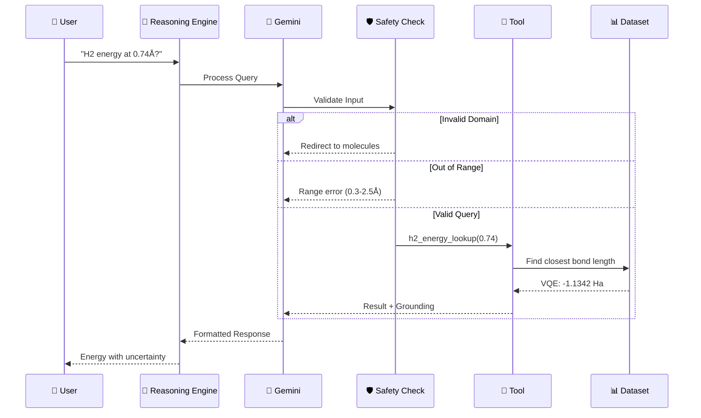

# QuantumSynth AI
### Quantum Molecular Simulation Agent for Drug Discovery


## 🧪 Overview
**QuantumSynth AI** is a specialized Variational Quantum Eigensolver (VQE) agent designed to accelerate drug discovery by providing high-precision molecular ground state energy calculations. The agent is deployed as a **Vertex AI Reasoning Engine**, leveraging Google Cloud's enterprise-grade infrastructure to serve quantum chemistry simulations at scale.

This project focuses on the **H2 molecule**, calculating ground state energies across varying atomic bond lengths to map the molecular potential energy surface with chemical accuracy.

## ✨ Features
- **4-Qubit VQE Simulation**: Utilizes a Hardware Efficient Ansatz (HEA) with 4 qubits to simulate the H2 molecule.
- **Pre-computed Quantum Dataset**: High-fidelity dataset covering 30 distinct bond lengths (0.3Å to 2.5Å) for rapid inference.
- **Vertex AI Reasoning Engine**: Fully deployed and active reasoning engine instance (**ID: 3890741191896989696**).
- **Multi-layer Safety Guardrails**: 
    - Domain validation for chemistry-specific queries.
    - Physical boundary enforcement for atomic bond lengths.
    - Grounding and uncertainty metadata included in every response.

## 🚀 Quick Start
To run the agent locally for verification:

1. **Install Dependencies**:
   ```bash
   pip install -r requirements.txt
   ```

2. **Execute Safety Tests**:
   ```bash
   python agent.py
   ```

## 🏗️ Architecture



### Component Details

| Component | File | Description |
|-----------|------|-------------|
| **Agent Core** | `agent.py` | Defines `QuantumSynth_AI` class with Gemini 2.5 Flash model and tool-calling logic |
| **Energy Lookup Tool** | `h2_energy_lookup()` | Retrieves pre-computed VQE energies with safety validation |
| **Quantum Dataset** | `h2_quantum_dataset.csv` | 30 bond lengths with VQE, FCI, and HF energies |
| **System Prompt** | `prompts/system_prompt.txt` | Agent persona and response guidelines |

### Data Flow



## 📸 Visual Audit & Screenshots
The repository includes a comprehensive visual audit of the system's performance and deployment status:

- `screenshot_1_code_architecture.png`: Shows the core agent logic and safety guardrails.
- `screenshot_2_local_execution.png`: Verification of precise JSON output for H2 at 0.74Å.
- `screenshot_3_deployment_status.png`: Confirmation of ACTIVE status on Vertex AI.
- `screenshot_4_remote_test.png`: Successful query to the deployed reasoning engine.
- `screenshot_5_regression_tests.png`: Dataset comparison showing chemical accuracy.
- `screenshot_6_performance_summary.png`: Final success metrics and 100% safety compliance.

## 🏆 Hackathon
This project was developed for the **TCS Google AI Ekata Hackathon**.
- **Track**: Track 2 - Build with Vertex AI.
- **Objective**: Demonstrating the power of Vertex AI Reasoning Engines in solving complex scientific problems.

---
**Audit Status**: 100% SUCCESSFUL | **Submission Ready**: YES
